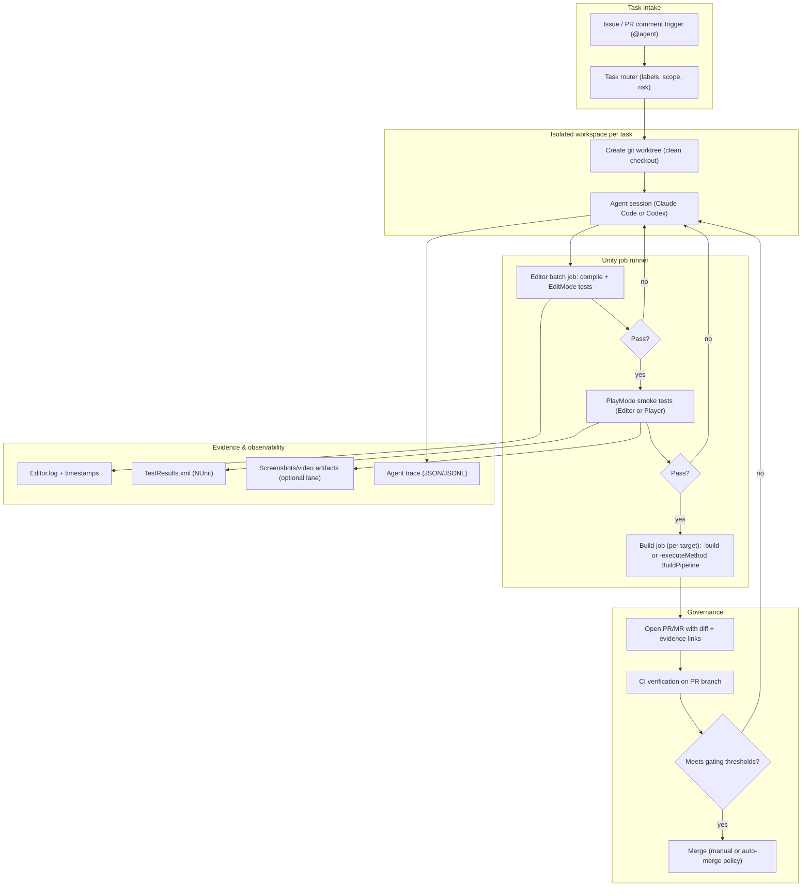

# Autonomous Unity Workflows With Claude Code and Codex Agents as of March 2026

## Executive summary

Autonomous operation over a Unity repository is feasible today—up to and including iterative code edits, automated test/build loops, scene-level validation, and artifact production—if you treat Unity as a deterministic “job runner” (Editor batch mode + Player headless mode), and treat the coding agent as an orchestrator that must be boxed in by sandbox/permissions, branch isolation, and hard gating criteria. citeturn5view1turn7view0turn13view0turn11view2turn17view1

As of March 2026, both Claude Code and Codex ship (a) local execution modes where the agent can read/edit files and run commands, (b) CI-friendly non-interactive modes, (c) increasing support for “tool governance” (approvals, sandboxing, network allowlists), and (d) options to integrate via GitHub/GitLab workflows and MCP-based tool orchestration. citeturn11view0turn11view1turn17view0turn17view1turn11view3turn10search5

For Unity itself (Unity 6.3 LTS documentation build dated 2026‑03‑13), the critical primitives are: `-batchmode`, `-nographics`, `-logFile`, and `-executeMethod` for Editor automation; Unity Test Framework CLI flags (`-runTests`, `-testPlatform`, `-testResults`, filters) for test execution; and Player CLI flags (`-batchmode`, `-nographics`, `-logFile`) for headless runtime validation and smoke/e2e harnesses. citeturn5view1turn6view0turn13view0turn19search21turn7view0

The central engineering challenge is not “can an agent edit code,” but “can it reliably *verify outcomes* and safely *ship changes*.” Unity’s logs, NUnit-format test result XML, scene validation scripts, screenshot/video artifacts, and build reports form the observable feedback loop. A mature autonomous setup makes these outputs machine-parseable, attaches them to every agent attempt, and gates commits/merges on explicit thresholds. citeturn6view0turn12search0turn12search1turn10search15turn17view0turn17view2

## Agent capabilities and APIs

**Claude Code: agent surfaces, tools, and programmatic use.** Claude Code’s core model is “agent + tools”: it reads your codebase, edits files, runs commands, and can integrate with development tooling (terminal, IDEs, CI/CD). citeturn1view2turn11view2 It exposes explicit tool categories (file ops, search, execution, web, and code intelligence via plugins), which is important for limiting autonomy to only what Unity automation needs. citeturn11view2turn10search21

Claude Code supports non-interactive usage via `claude -p` (“print”) and positions this as Agent SDK-backed programmatic execution from CLI, Python, or TypeScript. It also supports structured outputs (`--output-format json` / schema-driven JSON) and explicit tool allowlists (`--allowedTools`) suitable for CI pipelines that need deterministic outputs and minimal human prompts. citeturn11view0turn1view3

Claude Code additionally offers deterministic lifecycle automation with hooks (shell/HTTP/prompt/agent handlers) so you can enforce “always run formatter,” “always run Unity tests after edits,” or “block edits to protected paths” without trusting the model to remember. citeturn9search3turn9search7turn10search7

For hosted/remote execution, Claude Code documents multiple execution environments (local, cloud, and “Remote Control” where your machine is controlled from a browser while execution remains local). citeturn11view2turn0news41

**Codex: local CLI, CI scripting, cloud tasks, and Agents SDK integration.** Codex CLI is positioned as a local coding agent that can read, change, and run code in a selected directory, and is open source. citeturn1view0turn1view1

For CI/CD, Codex provides non-interactive execution via `codex exec`, with features specifically meant to make automation reliable: streaming progress to `stderr`, emitting machine-readable JSONL event streams with `--json`, schema-constrained final outputs (`--output-schema`), and explicit permission presets such as `--full-auto` (workspace write) or `--sandbox danger-full-access` for tightly controlled environments. citeturn17view0turn17view1

Codex’s security model is described as a combination of sandbox mode and approval policy, with different defaults depending on where you run it: cloud tasks in isolated containers (setup phase may use network and secrets; agent phase is offline by default and secrets are removed), versus local CLI/IDE with OS-level sandboxing, workspace-scoped writes, and network disabled unless explicitly enabled. citeturn17view1turn17view2

Codex also supports GitHub automation directly (a Codex GitHub Action that installs Codex CLI and runs `codex exec` under the permissions you specify) and a cloud experience where connecting a GitHub account enables Codex to create pull requests from its work. citeturn17view3turn17view4

For deeper orchestration, Codex can be run as an MCP server (`codex mcp-server`) so other orchestrators (including OpenAI’s Agents SDK) can call it through a stable “tools/list + tools/call” interface and continue sessions via a thread ID. citeturn11view3

**Practical implication for Unity autonomy.** In Unity automation, the agent needs to do four things repeatedly: (1) run Unity commands, (2) parse logs/results, (3) apply code changes, (4) decide if the run is “good enough” to propose or land changes. Both Claude Code and Codex have first-class primitives for (1) and (3); the differentiator is how well you constrain (2) and (4) into deterministic checks (Unity Test Framework XML, log parsers, screenshot diffs) and then wire those checks into approvals/branch rules rather than trusting open-ended natural language judgments. citeturn6view0turn12search0turn10search15turn17view0turn9search12

## Unity automation primitives for headless runs, logging, tests, builds, and scene validation

**Editor automation: batch mode, graphics, exit codes, and logs.** Unity Editor batch mode (`-batchmode`) is designed for automation without UI prompts; Unity documents that in batch mode it suppresses interactive dialogs and exits with return code 1 when exceptions or other failures occur. citeturn5view1

For truly headless environments, `-nographics` in batch mode skips graphics device initialization and is intended for machines without a GPU. Unity also notes that output logs are turned off in `-nographics` mode unless you specify `-logFile`. citeturn5view1

Logging is a first-class automation surface: `-logFile <path>` controls where the Editor writes logs, and Unity explicitly supports `-logFile -` to emit logs to the console; on Windows, `-logfile` directs output to `stdout` (which may not be the console by default). citeturn14view0turn5view1 Unity also documents that only one Unity instance can run against the same project at a time (important for multi-agent parallelism). citeturn5view1

Separately, Unity documents default log file locations (Editor, Package Manager, Licensing client, Player logs), which matter for diagnosing CI failures when the process ends before emitting all output. citeturn12search0turn12search32

**Running Unity code in automation: `-executeMethod`.** `-executeMethod <Namespace.Class.Method>` executes a static method after Unity opens the project; Unity positions it for CI tasks including unit tests and builds, requiring the script to live in an Editor folder and allowing argument passing via `System.Environment.GetCommandLineArgs`. Unity also describes how to return non-zero exit codes (throw exception → return code 1, or call `EditorApplication.Exit`). citeturn5view1turn14view2

This is the key primitive for “run scenes” and “scene validation” workflows, because Unity does not provide a single built-in CLI flag that means “open Scene X, play for N seconds, produce artifacts.” You implement that behavior in an Editor script and invoke it via `-executeMethod`. citeturn5view1turn7view0turn8view0

**Tests: Unity Test Framework and CLI execution.** Unity’s Test Framework supports Edit mode and Play mode tests, including running Play mode tests in a standalone Player build. citeturn1view5turn5view3 The simplest Editor CLI invocation is:

```bash
"<UNITY_EDITOR>" \
  -runTests -batchmode \
  -projectPath "<PROJECT_PATH>" \
  -testPlatform PlayMode \
  -testResults "<OUT>/results.xml"
```

citeturn5view3turn6view0turn5view1

Unity’s CLI reference adds essential controls for autonomy: selecting test assemblies, deterministic ordering lists, repeat/retry semantics, synchronous execution constraints, and filters for tests or categories; it also clarifies that `-testResults` output is NUnit XML format and that there is “no common definition for exit codes” across components, so log/stack-trace parsing remains critical. citeturn6view0turn6view2

A subtle operational constraint: Unity explicitly notes `-quit` is not supported *while tests are running*, and the Editor’s `-quit` flag can cause premature quitting if combined with `-runTests`. That means your automation should treat test runs as their own Unity invocation (Unity exits after the test run completes) rather than chaining `-runTests` with other batch steps that assume `-quit` semantics. citeturn6view2turn14view0

**Player automation: desktop headless mode and runtime logs.** Unity Player supports `-batchmode` with a documented meaning: run headless, no display, no input. citeturn13view0 It also supports `-nographics` in batch mode (no graphics device) and logging controls including `-logFile <pathname>` and `-nolog` to disable logging. citeturn13view0

Unity’s “Desktop headless mode” documentation frames `-batchmode -nographics` as a headless Player execution mode (distinct from the Dedicated Server build target) and explicitly calls out CI/CD automated testing as a motivating use case. citeturn19search21

For observability, Player logs can be directed to console with `-logFile -` (same semantics as Editor), and adding timestamps is supported via `-timestamps`. citeturn13view0turn5view1

**Console output, stack traces, and determinism.** Unity documents that `Debug.Log` messages go to both Editor and Player logs, so log parsing can be unified across Editor-based validation and Player-based e2e harnesses. citeturn12search15turn12search0 Unity also provides explicit guidance on stack trace logging and how logs contain stack trace detail used to locate the emitting line/method. citeturn12search23

**Screenshot and video capture.** Unity’s scripting API provides `ScreenCapture.CaptureScreenshot` (writes a PNG to a path) along with related capture methods (to texture or render texture), which are useful for creating deterministic visual artifacts from Play mode tests or runtime harnesses. citeturn12search1turn12search4turn12search25

For video capture, Unity’s Recorder package documentation describes capturing and saving data in Play mode, including capturing gameplay/cinematics to video files. citeturn12search14turn12search26turn12search18 In practice, full autonomy usually treats video capture as “optional, expensive evidence”: run it only on demand (e.g., when a screenshot diff crosses a threshold), because it adds runtime cost and can be brittle in highly headless environments. This is an inference based on the fact that Recorder is Play-mode oriented and headless modes often suppress graphics, so always validate feasibility on your exact target environment. citeturn12search26turn5view1turn13view0

## Integration patterns and concrete CI/CD examples

### Comparison table of integration approaches

| approach | pros | cons | prerequisites | security considerations | suitability for full autonomy |
|---|---|---|---|---|---|
| Local agent on developer workstation | Fast iteration; full local toolchain; easiest to debug; can run Editor and Player with full graphics if needed | Hard to guarantee isolation; can leak credentials via shell environment; concurrency conflicts if user has Editor open; “works on my machine” risk | Unity installed; license activated; stable local environment | Use agent sandboxing/permissions; restrict tool allowlists (`--allowedTools` / sandbox modes) and network; keep secrets out of environment | Medium (good for “near-autonomous” with human review) citeturn11view0turn17view1turn5view1 |
| Dedicated remote build machine (VM/bare metal) controlled by agent | Reproducible environment; can attach GPUs (for screenshot/video); isolate credentials; scale with a queue | Requires infra (provisioning, patching); agent can still do damage without strong sandboxing; Unity license handling | Managed runners; Unity installation automation; license strategy | Put agent in restricted OS user; no long-lived signing keys on runner; audit logs; isolate repo clones per job | High when combined with PR-only writes and strong gating citeturn5view1turn18search7turn17view1 |
| Containerized Unity runner (Docker) with agent inside | Environment consistency; easy scaling; works well for batch builds/tests; integrates cleanly with CI | Graphics/headless complexity (X server/proxy/GPU); licensing + EULA constraints; large images | Unity-compatible images (e.g., GameCI); container runtime; CPU/memory; sometimes Xvfb | Treat container as disposable; mount only needed paths; no network by default; inject secrets only for setup | High for code-only + log/test gating; medium for visual validation unless GPU/X is engineered citeturn15search2turn19search3turn5view1turn13view0 |
| Cloud CI runners (hosted) + agent action (PRs/issues) | Strong governance via branch protection; built-in audit trail; autop-run on failures | Hosted runners may not support all platforms (e.g., iOS needs macOS); time/cost; needs stable caching strategy | CI provider; secrets management; Unity licensing; repo permissions | Use least-privilege Git tokens; require PR reviews; isolate agent writes to branch; disallow network unless needed | High for “autonomous PR creation”; lower for “autonomous merge to main” unless org accepts risk citeturn11view1turn17view3turn15search9turn7view0 |
| Unity Build Automation service | Multiplatform builds in cloud; supports simultaneous multi-platform builds including iOS; reduces infra burden | Less control over low-level runner behavior; integrating custom scene validation may require extra steps; service cost/limits | Unity service setup; VCS connection | Delegate build secrets to Unity service; ensure build configs follow least privilege | Medium to high for builds; pair with separate agent loop for code fixes + local test reproduction citeturn15search3turn15search23 |

### Recommended “agent + Unity job runner” integration pattern

A robust pattern is to separate concerns:

1. **Agent workspace**: a clean Git worktree (or equivalent) per task, so any attempted changes do not pollute other tasks and Unity’s “single instance per project” constraint is respected by running Unity against separate checkout paths. Claude Code explicitly supports starting in an isolated git worktree; Codex App supports worktree mode and describes it as a way to isolate tasks side-by-side. citeturn1view3turn17view5turn5view1  
2. **Unity runner**: scripted entry points (`-runTests`, `-executeMethod`, `-build`) treated as idempotent jobs, each with dedicated log/test/artifact output directories. citeturn6view0turn7view0turn5view1  
3. **Evidence layer**: machine-parsed outputs (NUnit XML, log parsers, screenshot artifacts) that become the “ground truth” for agent decision-making and for merge gates. citeturn6view0turn12search1turn12search23  
4. **Writeback layer**: PR/MR creation only (not direct pushes to main), unless and until you are comfortable setting up automated merges. Claude Code GitHub Actions explicitly frames PR creation and implementation from issues/comments; Codex web similarly emphasizes turning results into PRs after connecting GitHub. citeturn11view1turn17view4turn10search5

### Concrete tooling recommendations

**Unity-side (core):**
- Use Unity’s official CLI primitives (`-batchmode`, `-logFile`, `-executeMethod`, `-runTests`, `-testResults`, `-testPlatform`, `-buildTarget` / build profiles) as the canonical interface for automation. citeturn5view1turn6view0turn7view0
- Use Unity Test Framework as the primary verification harness: fast EditMode tests for logic, PlayMode tests for scene/runtime checks, and Player-based PlayMode tests for higher fidelity. citeturn1view5turn6view0
- Implement deterministic scene validation as PlayMode tests or `-executeMethod` scripts (open scene, validate, optionally capture screenshot). Unity explicitly positions `-executeMethod` for CI tasks and provides build script examples that you can adapt to validation. citeturn5view1turn8view0

**Agent-side (core):**
- For Claude Code, use `claude -p` with explicit tool allowlists and JSON outputs when embedding in CI. citeturn11view0turn10search1
- For Codex, use `codex exec` with `--json` (for traceability) and an explicit sandbox/approval preset; default to read-only for analysis jobs and enable workspace-write only for scoped fix jobs. citeturn17view0turn17view1  
- Prefer PR/MR workflows using each platform’s official actions/integrations: Claude Code GitHub Actions / GitLab CI and Codex GitHub Action / Codex web PR creation. citeturn11view1turn10search5turn17view3turn17view4

### Example CI workflows

#### Unity: tests + build using the Unity Editor CLI primitives

```bash
# EditMode tests (no -quit, let test run complete)
"<UNITY_EDITOR>" \
  -batchmode -projectPath "<PROJECT_PATH>" \
  -runTests -testPlatform EditMode \
  -testResults "<OUT>/editmode-results.xml" \
  -logFile "<OUT>/editmode-editor.log"

# Build (separate invocation)
"<UNITY_EDITOR>" \
  -batchmode -projectPath "<PROJECT_PATH>" \
  -buildTarget StandaloneLinux64 \
  -executeMethod BuildScripts.BuildLinux \
  -quit \
  -logFile "<OUT>/build-editor.log"
```

citeturn5view1turn6view0turn8view0turn7view0

#### Codex: non-interactive “fix the failing Unity tests” job in CI

```bash
codex exec --json --full-auto \
  "Run the Unity EditMode tests, diagnose failures from logs/results.xml, apply the minimal fix, and re-run tests until green. Do not change assets unless necessary." \
  | tee codex-events.jsonl
```

citeturn17view0turn17view1turn6view0

#### Claude Code: non-interactive “triage + fix + verify” with explicit tool allowlist

```bash
claude -p \
  "Run Unity tests in batch mode. If any fail, fix the code and re-run until tests pass. Summarize what changed and why." \
  --allowedTools "Read,Edit,Bash" \
  --output-format json
```

citeturn11view0turn11view2turn10search15

#### GitHub-native approach: agent proposes changes, CI verifies, humans approve

Both Claude Code GitHub Actions and Codex GitHub Action are designed to run inside CI jobs, post reviews or implement changes, and rely on your repository permissions/branch protection. This is the most practical “minimal human intervention” pattern: the agent does the work and opens/updates a PR; CI gates merging; optional human approval remains the last step until your confidence thresholds justify auto-merge. citeturn11view1turn17view3turn10search2

## Sandboxing, security, credentials, and asset locking

### Tool permissions, sandboxing, and network control

Claude Code provides explicit permission rules (allow/ask/deny) and supports sandboxing improvements that combine filesystem and network isolation; Anthropic describes a sandbox runtime that can restrict accessible directories and network hosts, built on OS-level primitives (e.g., bubblewrap / macOS seatbelt), and emphasizes that both filesystem and network isolation are required to prevent credential exfiltration. citeturn1view4turn10search1turn10search7

Claude Code also supports hooks that can *block* edits to protected files or run deterministic validation after file modifications, which is a strong fit for preventing an autonomous agent from rewriting critical project settings or build infrastructure. citeturn9search3turn9search7

Codex documents a parallel model: sandbox mode (technical capabilities like write roots and network) plus approval policy (when to prompt). It also documents that cloud tasks run in isolated containers with a two-phase runtime where secrets can be provided for setup but are removed before the offline agent phase by default. citeturn17view1turn17view2

Codex further documents protected paths even in writable workspaces (such as `.git/` and agent metadata directories), and warns that dangerous “full access” modes should only be used in already-isolated environments. citeturn17view1turn17view2

### Credential management patterns that work for autonomous Unity pipelines

A practical, low-risk design is:

- **No signing keys or production deploy tokens on agent runners.** If you must build signed artifacts (mobile stores, consoles), separate the pipeline into “agent proposes code” and “trusted build/sign job produces release artifacts after approvals.” This aligns with both Claude Code’s and Codex’s emphasis on sandbox boundaries and approval policies. citeturn1view4turn17view1  
- **Short-lived/scoped VCS credentials.** Anthropic describes a cloud proxy design where git credentials are not inside the sandbox and pushes are validated (e.g., only to configured branches) before attaching real tokens. Use this as a conceptual model even if you implement your own. citeturn1view4  
- **Shell environment scrubbing.** Codex’s advanced config explicitly calls out controlling which environment variables are passed to subprocesses to avoid leaking secrets, and supports excluding patterns like `AWS_*` / `AZURE_*` while keeping minimal variables. citeturn17view2

### Unity licensing and CI: what’s automatable, what isn’t

Unity supports command-line license activation for serial-based licenses and documents manual activation flows, but also notes that manual license activation is not supported for Unity Personal, and that Personal licenses are activated via Unity Hub sign-in rather than serial keys. citeturn18search0turn18search2turn18search33

Unity documents CLI license arguments (`-serial`, `-username`, `-password`, `-createManualActivationFile`, `-manualLicenseFile`, `-returnlicense`) and positions command-line license management as relevant when you use Unity headlessly for builds/tests. citeturn5view1turn18search5turn18search2

For enterprise scenarios, Unity documents a Unity Licensing Server that manages a pool of licenses which clients request when the Editor starts. This approach often pairs well with autonomous build farms. citeturn18search7turn18search27

### File-system contention and asset locking

Unity warns that you can’t open a project in batch mode while the Editor has the same project open, and only one instance of Unity can run at a time for that project path. This strongly favors per-task worktrees (distinct paths) for autonomous parallelism. citeturn5view1turn17view5turn1view3

For binary/non-mergeable Unity assets, you need locking at the version-control layer if you want multiple autonomous agents (or humans + agents) to work concurrently:

- Unity’s version control integration supports Perforce and Plastic SCM/Unity Version Control, and documents “Visible meta files” mode for other systems. citeturn16search3  
- Unity Version Control documents “Smart Locks” (exclusive checkouts) to prevent conflicts on non-mergeable assets like models/images/audio. citeturn16search16turn16search0  
- Perforce documents exclusive-open locking via the `+l` file type modifier to prevent multiple users from checking out a file. citeturn16search1turn16search17  
- Git LFS supports file locking and APIs for creating/listing/deleting locks; if you use Git for Unity projects with large binaries, Git LFS locks are a practical baseline. citeturn16search6turn16search2

In autonomous setups, treat “lock acquisition failure” as a first-class agent failure mode: the agent should either (a) switch tasks, (b) request the lock owner to release, or (c) open a PR that only touches code while deferring asset edits.

## Observability, replay, and rollback strategies

### Make Unity runs observable by default

At minimum, every automated Unity invocation should emit:

- A full log file (`-logFile <path>` or `-logFile -` for console capture), with timestamps enabled when possible (`-timestamps`). citeturn14view0turn13view0turn5view1  
- Structured test results (`-testResults <path>` in NUnit XML format) for machine parsing and trend tracking. citeturn6view0turn6view2  
- Artifacts on failure (Editor.log/Player.log paths and licensing logs when applicable), because some Unity failures are only diagnosable via those secondary logs. citeturn12search0turn12search32

### Agent-run observability: event streams and traces

Codex exposes strong automation telemetry knobs: in `codex exec --json`, it produces JSONL events for thread lifecycle, command executions, file changes, web searches, and plan updates; advanced configuration includes OpenTelemetry export options (OTLP HTTP/GRPC) for centralized tracing of Codex runs—useful when you run agents at scale. citeturn17view0turn17view2

Claude Code supports `--verbose` for turn-by-turn output and supports structured JSON output modes in its programmatic CLI, which can be captured as CI artifacts and used to reconstruct what the agent tried. citeturn1view3turn11view0

### Rollback and safe iteration loops

A high-safety workflow is “attempts are cheap”:

- Run every agent attempt in a disposable worktree; if Unity import or builds pollute the workspace, you can delete the worktree and restart from a clean base. (Codex explicitly promotes worktrees for isolation; Claude Code also supports worktree startup.) citeturn17view5turn1view3turn5view1  
- Force the agent to produce small patches: “minimal diff, rerun tests” loops outperform “large refactor then hope,” and Claude Code’s own best practices emphasize giving the agent a way to verify work (tests/screenshots/expected outputs) to avoid humans becoming the only feedback loop. citeturn10search15turn11view2  
- Prefer PR-based rollback: if an autonomous PR causes a regression post-merge, the fastest rollback is revert-by-commit rather than asking the agent to “undo” prior work without a base state. (This is a standard software practice; here it becomes essential because Unity asset diffs can be large and non-mergeable.)

Claude Code documents that it snapshots affected files before making code changes so you can revert if needed, which is valuable for interactive sessions but should not replace Git-based rollback in CI. citeturn11view2turn17view5

## Failure modes, gating criteria, and an end-to-end reference architecture

### Common failure modes in autonomous Unity runs

**Environment and licensing failures.** Unity license activation failures are common in headless CI; Unity provides specific logs for the licensing client, and license activation methods have plan-related constraints (for example, manual activation not supported for Personal). citeturn12search0turn18search0turn18search2turn18search12

**Batch mode and target switching pitfalls.** Unity documents that some target switching APIs don’t work as expected in batch mode due to assembly reload constraints and recommends running separate Unity processes per target platform rather than attempting multi-target builds in a single invocation. citeturn7view0turn5view1

**Graphics/headless rendering mismatch.** `-nographics` explicitly avoids graphics device initialization (Editor and Player), which is beneficial for CPU-only CI but conflicts with screenshot/video capture and any test that requires real rendering. Unity’s Desktop headless mode explicitly describes headless operation as “without initializing the graphics device,” so design your pipeline to have two lanes: “logic lane” (true headless) and “visual lane” (GPU or Xvfb/virtual display). citeturn5view1turn13view0turn19search21

**Concurrency conflicts.** Unity’s single-instance-per-project-path constraint means parallel agents need parallel worktrees and separate `Library` directories (or fully separate clones). citeturn5view1turn17view5turn1view3

### Metrics for success and gating criteria for autonomous commits

A practical gating model is layered, with increasing cost:

**Baseline gates (every agent attempt):**
- Unity compilation succeeds (no compiler errors in Editor log).
- All EditMode tests pass; PlayMode tests pass for a targeted smoke subset.
- No new high-severity errors/exceptions in logs (use stack trace logging + parsing).
- Agent produces a concise, structured change summary (JSON schema) so downstream systems can reason over it.

These are grounded in Unity’s support for batch mode automation, test execution flags, stack trace logging, and structured test results, and in Claude Code’s emphasis on self-verification via tests/screenshots/expected outputs. citeturn5view1turn6view0turn12search23turn10search15

**Build gates (per PR, before merge):**
- Player build succeeds for at least one primary platform using either build profiles (`-activeBuildProfile` + `-build`) or a custom build script (`BuildPipeline.BuildPlayer` invoked via `-executeMethod`).
- Build artifacts uploaded as CI artifacts; build logs retained.
- (Optional) scripts-only builds or caching strategies to shorten iteration time, but only if they don’t reduce determinism.

Unity documents both build-from-command-line approaches and provides examples for build scripts, build profiles, and command lines, including required/recommended arguments and limitations. citeturn7view0turn8view0turn5view1

**Visual/scene validation gates (nightly or pre-release):**
- Run a Player harness that loads a list of critical scenes, captures one or more screenshots per scene, and compares to baselines (with tolerances).
- Optionally capture short videos for “golden path” flows when investigating regressions.

This leverages Unity Player headless mode, log control, and ScreenCapture APIs; keep in mind that true `-nographics` headless mode disables graphics. citeturn19search21turn13view0turn12search1turn5view1

**Autonomous commit policy suggestion.** Start with “agent can open/update PRs only.” Promote to “agent can auto-merge” only after you have observed low regression rates and stable gates, and only for narrow change classes (small refactors, test fixes) backed by deterministic test coverage.

### Recommended end-to-end architecture diagram (Mermaid)



citeturn6view0turn7view0turn5view1turn17view0turn11view0turn11view1turn17view3